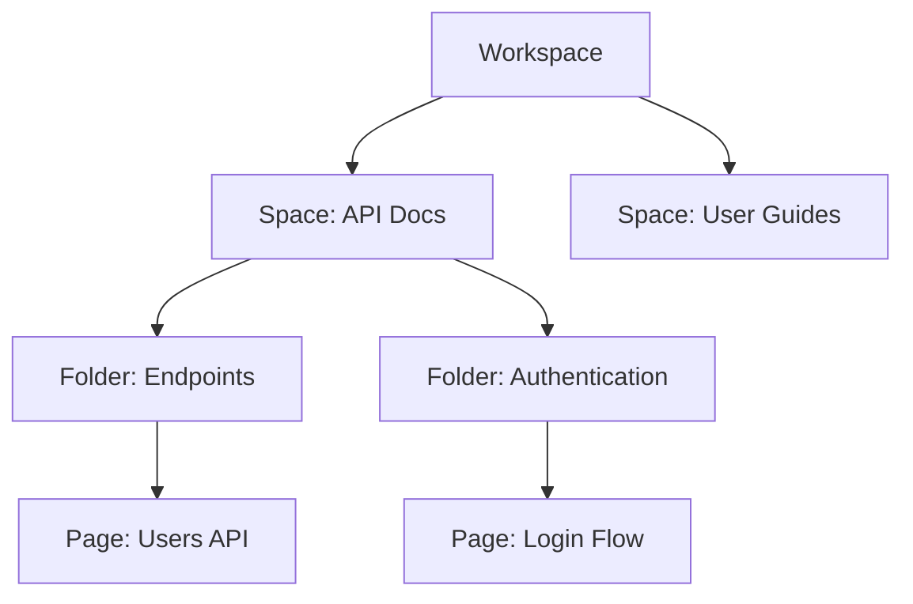

## Overview

You organize all your project documentation in Umashankar Sahu's platform using core concepts like spaces, pages, hierarchies, version control, and collaboration. These building blocks enable you to create structured, versioned, and team-friendly docs. Master them to build efficient documentation workflows.

<Columns cols={3}>
  <Card title="Spaces & Pages" icon="book-open" href="#spaces-and-pages">
    Fundamental units for organizing content.
  </Card>
  <Card title="Organization Hierarchy" icon="layers" href="#project-organization-hierarchy">
    Nested structure for projects and docs.
  </Card>
  <Card title="Version Control" icon="git-branch" href="#version-control-basics">
    Track changes with Git integration.
  </Card>
</Columns>

## Spaces and Pages

Spaces act as top-level containers for your documentation projects. You create a space for each major initiative, such as "API Docs" or "User Guides". Pages live inside spaces and form the content leaves—Markdown or MDX files you edit directly.

<Callout kind="info">
  Each space supports unlimited pages with full-text search across all content.
</Callout>

Use pages to document features, guides, or APIs. Pages support rich MDX formatting, including components like `<Callout>` for emphasis.

## Project Organization Hierarchy

Your projects follow a clear hierarchy: Workspace → Spaces → Folders → Pages. This structure scales from single-user notes to enterprise docs.



<Expandable title="Advanced Hierarchy Tips" default-open="false">
  Folders can nest infinitely. Use them to mirror your codebase structure, like `src/components/Button.mdx`.
</Expandable>

## Version Control Basics

Integrate Git for version control. Connect your space to a GitHub repository to enable branching, commits, and pull requests directly in the platform.

<CodeGroup tabs="GitHub,Bitbucket">
  ```bash
  # Clone and connect your repo
  git clone https://github.com/umashankarsahu/docs-repo.git
  cd docs-repo
  git remote add platform https://git.umashankarsahu.com/spaces/your-space.git
  git push platform main
  ```
  ```bash
  # Branch for new feature
  git checkout -b feature/new-page
  # Edit pages, commit, and push
  git add .
  git commit -m "Add core concepts page"
  git push platform feature/new-page
  ```
</CodeGroup>

<Callout kind="tip">
  Enable auto-publishing on merge to `main` for seamless deployments.
</Callout>

## Collaboration Workflows

Collaborate seamlessly with roles like Owner, Editor, and Viewer. Follow these steps for team contributions.

<Steps>
  <Step title="Assign Roles" icon="users">
    Invite team members via email. Set permissions per space.
  </Step>
  <Step title="Review Changes" icon="git-pull-request">
    Use pull requests to review edits before merging.
  </Step>
  <Step title="Resolve Conflicts" icon="alert-triangle">
    Merge conflicts appear inline—resolve directly in the editor.
  </Step>
  <Step title="Publish Updates" icon="rocket">
    Merge to `main` triggers instant live updates.
  </Step>
</Steps>

<Tabs>
  <Tab title="Editor Workflow" icon="edit-3">
    Editors draft pages and submit PRs for approval.
  </Tab>
  <Tab title="Reviewer Workflow" icon="check-circle">
    Reviewers comment inline and approve merges.
  </Tab>
</Tabs>

## Next Steps

<Card title="Quickstart" icon="zap" href="/quickstart">
  Set up your first space in minutes.
</Card>

<Card title="Advanced Collaboration" icon="users" href="/collaboration">
  Dive into permissions and webhooks.
</Card>