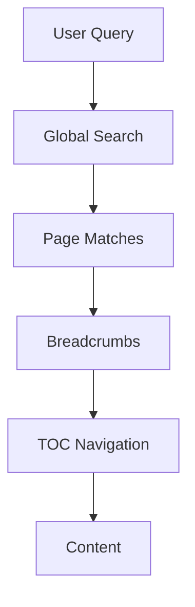

## Overview

Manage your Umashankar Sahu project documentation effectively to keep your team aligned and information accessible. You edit pages directly in the editor, import content from external sources, leverage built-in search and navigation, and export for sharing. This guide covers essential workflows to structure your docs for scalability.

<Columns cols={3}>
  <Card title="Edit Pages" icon="edit-3" href="#editing-and-formatting-pages">
    Update content with rich formatting tools.
  </Card>
  <Card title="Import Content" icon="upload" href="#importing-external-content">
    Bring in Markdown or API data seamlessly.
  </Card>
  <Card title="Search & Navigate" icon="search" href="#search-and-navigation-tools">
    Find information quickly across your docs.
  </Card>
</Columns>

## Editing and Formatting Pages

Edit pages using the visual editor or Markdown mode. You structure content with headings, lists, and components for professional results.

<Steps>
  <Step title="Access Editor" icon="edit">
    Open any page and click the edit button in the top-right corner.
  </Step>
  <Step title="Format Content">
    Use the toolbar for bold, italics, links, and code blocks. Switch to Markdown for advanced syntax.
  </Step>
  <Step title="Add Components">
    Insert `<Callout>` or `<Steps>` via the components panel to enhance readability.
  </Step>
  <Step title="Preview & Publish">
    Preview changes, then save to publish instantly.
  </Step>
</Steps>

Format frontmatter correctly to avoid parsing errors:

<CodeGroup tabs="YAML,JSON">
  ```yaml
  ---
  title: My Page
  description: Page summary
  ---
  ```
  ```json
  {
    "title": "My Page",
    "description": "Page summary"
  }
  ```
</CodeGroup>

<Callout kind="tip">
  Always wrap special characters like `{variable}` or `<100ms` in backticks in prose to prevent MDX parsing issues.
</Callout>

## Importing External Content

Import Markdown files, GitHub repos, or API responses to populate your docs quickly.

<Tabs>
  <Tab title="Markdown Files" icon="file-text">
    Drag and drop `.mdx` files into your project folder. The system auto-processes frontmatter and components.
  </Tab>
  <Tab title="GitHub Repo" icon="github">
    Connect your repo via settings. Sync branches to mirror changes.
    
    ```bash
    git clone https://github.com/umashankar-sahu/project-docs.git
    ```
  </Tab>
  <Tab title="API Import" icon="zap">
    Use the import tool to fetch from endpoints like `https://api.example.com/docs`.
    
    <ParamField path="format" param-type="string" required="true">
      Specify `mdx` or `markdown`.
    </ParamField>
  </Tab>
</Tabs>

## Search and Navigation Tools

Built-in tools help you locate content efficiently.

| Tool | Description | Shortcut |
|------|-------------|----------|
| Global Search | Full-text search across all pages | `Ctrl+K` or `/` |
| Breadcrumbs | Hierarchical navigation | Always visible |
| Table of Contents | Auto-generated sidebar | Toggle with `TOC` button |
| Tags | Filter by labels like `guide` or `api` | Sidebar filters |

<Expandable title="Advanced Search Filters" default-open="false">
  Combine keywords with filters: `auth {API_KEY}` searches for authentication pages mentioning API keys.
</Expandable>



## Exporting Documentation

Export your docs for offline use or integration.

<Steps>
  <Step title="Select Format" icon="download">
    Choose PDF, HTML, or ZIP from export menu.
  </Step>
  <Step title="Configure Options">
    
````javascript
const exportConfig = {
  includePrivate: false,
  format: 'pdf',
  theme: 'light'
};
````
    
  </Step>
  <Step title="Generate & Download">
    Click export to download the bundle.
  </Step>
</Steps>

<Callout kind="success">
  Exported docs retain interactive components like `<Tabs>` for HTML formats.
</Callout>

<Columns cols={2}>
  <Card title="Next: Quickstart" icon="rocket" href="/quickstart">
    Set up your first project.
  </Card>
  <Card title="Changelog" icon="git-branch" href="/changelog">
    See recent updates.
  </Card>
</Columns>